# Anonymous Message Board

[Segundo proyecto](https://www.freecodecamp.org/learn/information-security/information-security-projects/anonymous-message-board) requisito obligatorio para obtener la **Information Security Certification** de freecodecamp.

El proyecto consiste en crear dos API con los métodos GET, POST, PUT y DELETE para manipular threads de un board y replies para cada thread en dicho board. La primera API "escucha" en el siguiente path:

> /api/threads/:board

Dicha API permite obtener, crear, editar o eliminar threads para el board el cual es pasado como request parameter en la URL también en función de data pasada desde el front end y/o como query parameter.

La segunda API escucha en el siguiente path:

> /api/replies/:board

Dicha API permite obtener, crear, editar o eliminar replies para cada thread pasando el board en dicha ruta junto con data extra en función de lo que se desee realizar.

## Tabla de Contenidos

- [Anonymous Message Board](#anonymous-message-board)
  - [Tabla de Contenidos](#tabla-de-contenidos)
  - [Requisitos de freecodecamp aprobados](#requisitos-de-freecodecamp-aprobados)
  - [Deploy](#deploy)
  - [Proyecto Aprobado](#proyecto-aprobado)
  - [Tests funcionales aprobados](#tests-funcionales-aprobados)
  - [Tests Funcionales Creados](#tests-funcionales-creados)
    - [1. Creating a new thread: POST request to /api/threads/{board}](#1-creating-a-new-thread-post-request-to-apithreadsboard)
    - [2.Viewing the 10 most recent threads with 3 replies each: GET request to /api/threads/{board}](#2viewing-the-10-most-recent-threads-with-3-replies-each-get-request-to-apithreadsboard)
    - [3.Deleting a thread with the incorrect password: DELETE request to /api/threads/{board} with an invalid delete_password](#3deleting-a-thread-with-the-incorrect-password-delete-request-to-apithreadsboard-with-an-invalid-delete_password)
    - [4.Deleting a thread with the correct password: DELETE request to /api/threads/{board} with a valid delete_password](#4deleting-a-thread-with-the-correct-password-delete-request-to-apithreadsboard-with-a-valid-delete_password)
    - [5.Reporting a thread: PUT request to /api/threads/{board}](#5reporting-a-thread-put-request-to-apithreadsboard)
    - [6.Creating a new reply: POST request to /api/replies/{board}](#6creating-a-new-reply-post-request-to-apirepliesboard)
    - [7.Viewing a single thread with all replies: GET request to /api/replies/{board}](#7viewing-a-single-thread-with-all-replies-get-request-to-apirepliesboard)
    - [8.Deleting a reply with the incorrect password: DELETE request to /api/replies/{board} with an invalid delete_password](#8deleting-a-reply-with-the-incorrect-password-delete-request-to-apirepliesboard-with-an-invalid-delete_password)
    - [9.Deleting a reply with the correct password: DELETE request to /api/replies/{board} with a valid delete_password](#9deleting-a-reply-with-the-correct-password-delete-request-to-apirepliesboard-with-a-valid-delete_password)
    - [10.Reporting a reply: PUT request to /api/replies/{board}](#10reporting-a-reply-put-request-to-apirepliesboard)
  - [Screenshots](#screenshots)
    - [1. Home Page](#1-home-page)
    - [2. Board Page](#2-board-page)
    - [3.Board with thread](#3board-with-thread)
    - [4. Thread Page](#4-thread-page)
    - [5.Thread Page with reply](#5thread-page-with-reply)
    - [6.Board with many threads and replies](#6board-with-many-threads-and-replies)
    - [7.GET to /api/threads/board](#7get-to-apithreadsboard)
    - [8. GET to /api/replies/{board}?thread_id={thread_id}](#8-get-to-apirepliesboardthread_idthread_id)

## Requisitos de freecodecamp aprobados

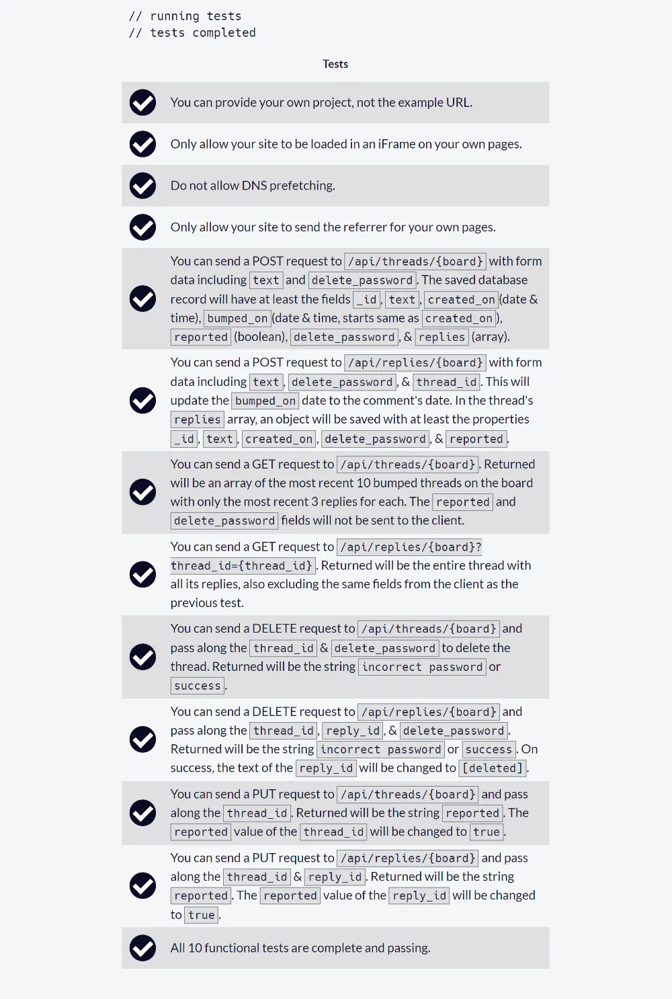

## Deploy

El proyecto lo he desplegado en mi cuenta gratuita en Render el cual tarda al menos 50 segundos en cargar para su utilización después de inactividad.

## Proyecto Aprobado

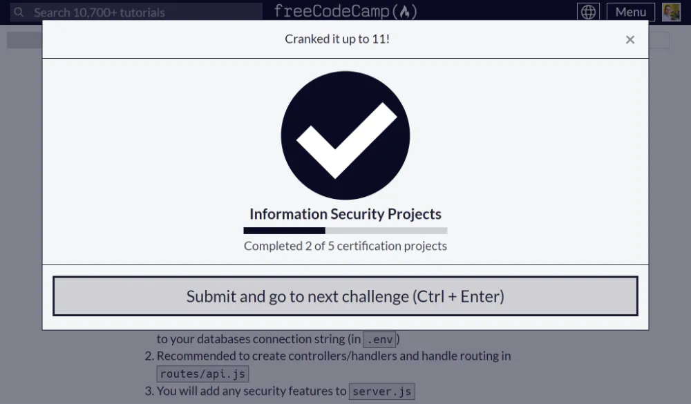

## Tests funcionales aprobados

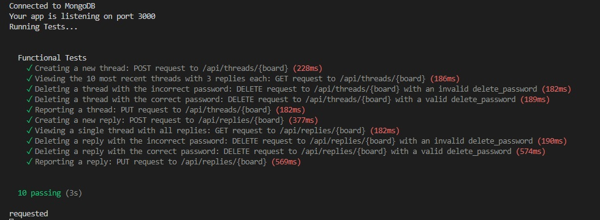

Tests funcionales aprobados en Render:

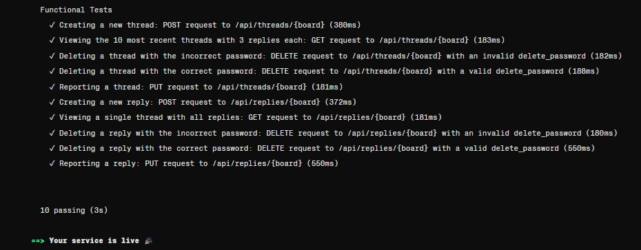

## Tests Funcionales Creados

### 1. Creating a new thread: POST request to /api/threads/{board}

```js
let id = null;
// Creating a new thread: POST request to /api/threads/{board}
test("Creating a new thread: POST request to /api/threads/{board}", function (done) {
  chai
    .request(server)
    .keepOpen()
    .post("/api/threads/test")
    .send({
      text: "This is a new thread",
      delete_password: "1234",
    })
    .end(function (err, res) {
      id = res.body.id;
      assert.equal(res.status, 200);
      assert.equal(res.body.text, "This is a new thread");
      done();
    });
});
```

### 2.Viewing the 10 most recent threads with 3 replies each: GET request to /api/threads/{board}

```js
test("Viewing the 10 most recent threads with 3 replies each: GET request to /api/threads/{board}", function (done) {
  chai
    .request(server)
    .keepOpen()
    .get("/api/threads/test")
    .end(function (err, res) {
      assert.equal(res.status, 200);
      assert.isAtMost(res.body.length, 10);
      assert.isAtMost(res.body[0].replies.length, 3);
      done();
    });
});
```

### 3.Deleting a thread with the incorrect password: DELETE request to /api/threads/{board} with an invalid delete_password

```js
test("Deleting a thread with the incorrect password: DELETE request to /api/threads/{board} with an invalid delete_password", function (done) {
  chai
    .request(server)
    .keepOpen()
    .delete("/api/threads/test")
    .send({
      thread_id: id,
      delete_password: "incorrect_password",
    })
    .end(function (err, res) {
      assert.equal(res.status, 200);
      assert.equal(res.text, "incorrect password");
      done();
    });
});
```

### 4.Deleting a thread with the correct password: DELETE request to /api/threads/{board} with a valid delete_password

```js
test("Deleting a thread with the correct password: DELETE request to /api/threads/{board} with a valid delete_password", function (done) {
  chai
    .request(server)
    .keepOpen()
    .delete("/api/threads/test")
    .send({
      thread_id: id,
      delete_password: "1234",
    })
    .end(function (err, res) {
      assert.equal(res.status, 200);
      assert.equal(res.text, "success");
      done();
    });
});
```

### 5.Reporting a thread: PUT request to /api/threads/{board}

```js
test("Reporting a thread: PUT request to /api/threads/{board}", function (done) {
  chai
    .request(server)
    .keepOpen()
    .put("/api/threads/test")
    .send({
      thread_id: id,
    })
    .end(function (err, res) {
      assert.equal(res.status, 200);
      assert.equal(res.text, "reported");
      done();
    });
});
```

### 6.Creating a new reply: POST request to /api/replies/{board}

```js
test("Creating a new reply: POST request to /api/replies/{board}", function (done) {
  chai
    .request(server)
    .keepOpen()
    .post("/api/threads/test")
    .send({
      text: "This is a new thread",
      delete_password: "1234",
    })
    .end(function (err, res) {
      id = res.body.id;
      assert.equal(res.status, 200);
      assert.equal(res.body.text, "This is a new thread");

      // crear una nueva respuesta
      chai
        .request(server)
        .keepOpen()
        .post("/api/replies/test")
        .send({
          thread_id: id,
          text: "This is a new reply",
          delete_password: "1234",
        })
        .end(function (err, res) {
          assert.equal(res.status, 200);
          assert.equal(res.text, "success");
          done();
        });
    });
});
```

### 7.Viewing a single thread with all replies: GET request to /api/replies/{board}

```js
test("Viewing a single thread with all replies: GET request to /api/replies/{board}", function (done) {
  chai
    .request(server)
    .keepOpen()
    .get("/api/replies/test?thread_id=" + id)
    .end(function (err, res) {
      assert.equal(res.status, 200);
      assert.equal(res.body._id, id);
      assert.equal(res.body.board, "test");
      // verificar si replies es un arreglo
      assert.isArray(res.body.replies);
      // verificar que el campo reported sea undefined
      assert.isUndefined(res.body.reported, undefined);
      // verificar que el campo delete_password sea undefined
      assert.isUndefined(res.body.delete_password, undefined);

      done();
    });
});
```

### 8.Deleting a reply with the incorrect password: DELETE request to /api/replies/{board} with an invalid delete_password

```js
test("Deleting a reply with the incorrect password: DELETE request to /api/replies/{board} with an invalid delete_password", function (done) {
  chai
    .request(server)
    .keepOpen()
    .delete("/api/replies/test")
    .send({
      thread_id: id,
      reply_id: id,
      delete_password: "incorrect_password",
    })
    .end(function (err, res) {
      assert.equal(res.status, 200);
      assert.equal(res.text, "incorrect password");
      done();
    });
});
```

### 9.Deleting a reply with the correct password: DELETE request to /api/replies/{board} with a valid delete_password

```js
let id_reply = null;
test("Deleting a reply with the correct password: DELETE request to /api/replies/{board} with a valid delete_password", function (done) {
  // crear una nueva reply
  chai
    .request(server)
    .keepOpen()
    .post("/api/replies/test")
    .send({
      thread_id: id,
      text: "This is a new reply",
      delete_password: "1234",
    })
    .end(function (err, res) {
      assert.equal(res.status, 200);
      assert.equal(res.text, "success");

      // obtener la id de la respuesta
      chai
        .request(server)
        .keepOpen()
        .get("/api/replies/test?thread_id=" + id)
        .end(function (err, res) {
          //obtener el id de la respuesta en el primer elemento del array replies
          id_reply = res.body.replies[0]._id;
          chai
            .request(server)
            .keepOpen()
            .delete("/api/replies/test")
            .send({
              thread_id: id,
              reply_id: id_reply,
              delete_password: "1234",
            })
            .end(function (err, res) {
              assert.equal(res.status, 200);
              assert.equal(res.text, "success");
              done();
            });
        });
    });
});
```

### 10.Reporting a reply: PUT request to /api/replies/{board}

```js
test("Reporting a reply: PUT request to /api/replies/{board}", function (done) {
  // crear una nueva reply
  chai
    .request(server)
    .keepOpen()
    .post("/api/replies/test")
    .send({
      thread_id: id,
      text: "This is a new reply",
      delete_password: "1234",
    })
    .end(function (err, res) {
      assert.equal(res.status, 200);
      assert.equal(res.text, "success");

      // obtener la id de la respuesta
      chai
        .request(server)
        .keepOpen()
        .get("/api/replies/test?thread_id=" + id)
        .end(function (err, res) {
          //obtener el id de la respuesta en el primer elemento del array replies
          id_reply = res.body.replies[0]._id;
          //reportar la reply creada
          chai
            .request(server)
            .keepOpen()
            .put("/api/replies/test")
            .send({
              thread_id: id,
              reply_id: id_reply,
            })
            .end(function (err, res) {
              assert.equal(res.status, 200);
              assert.equal(res.text, "reported");
              done();
            });
        });
    });
});
```

## Screenshots

### 1. Home Page

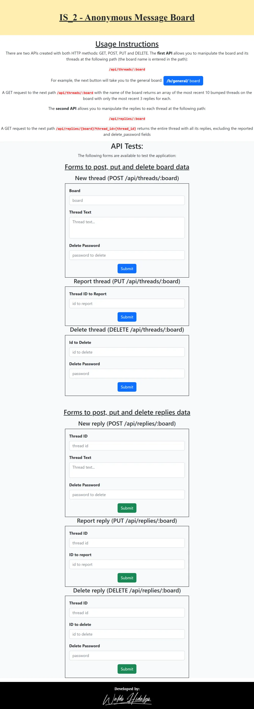

### 2. Board Page

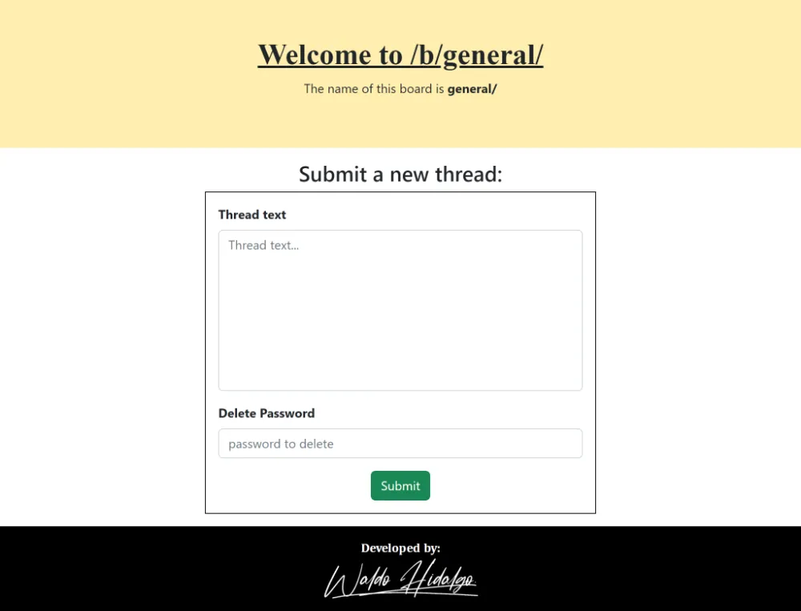

### 3.Board with thread

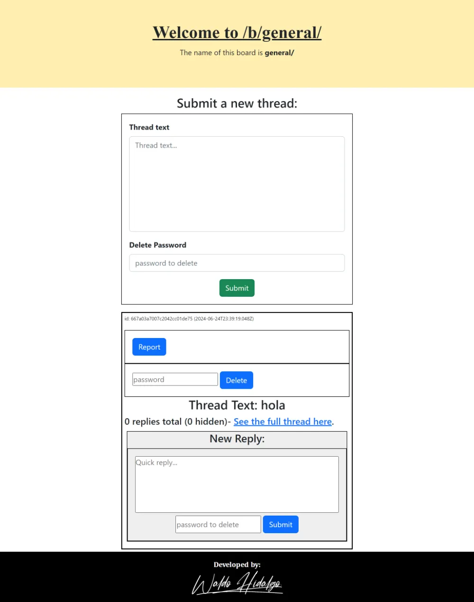

### 4. Thread Page

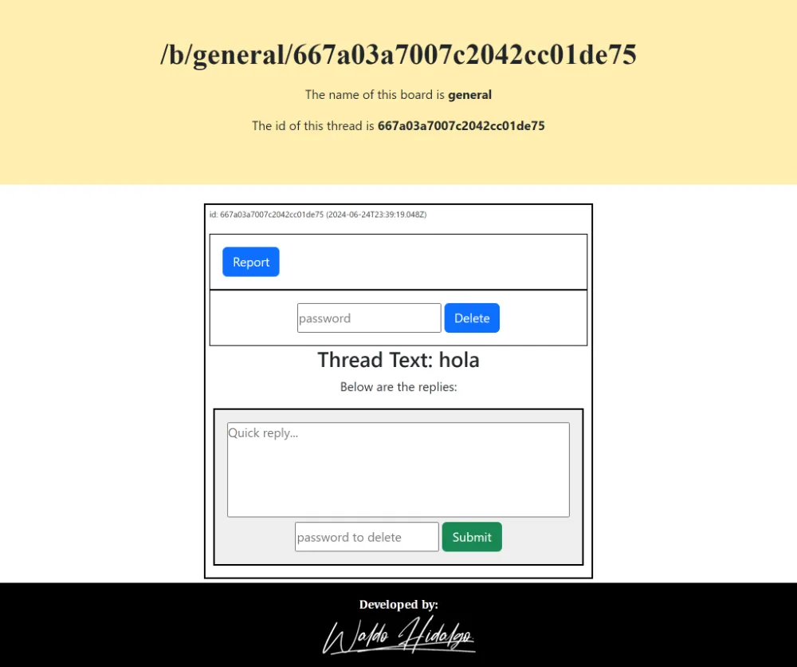

### 5.Thread Page with reply

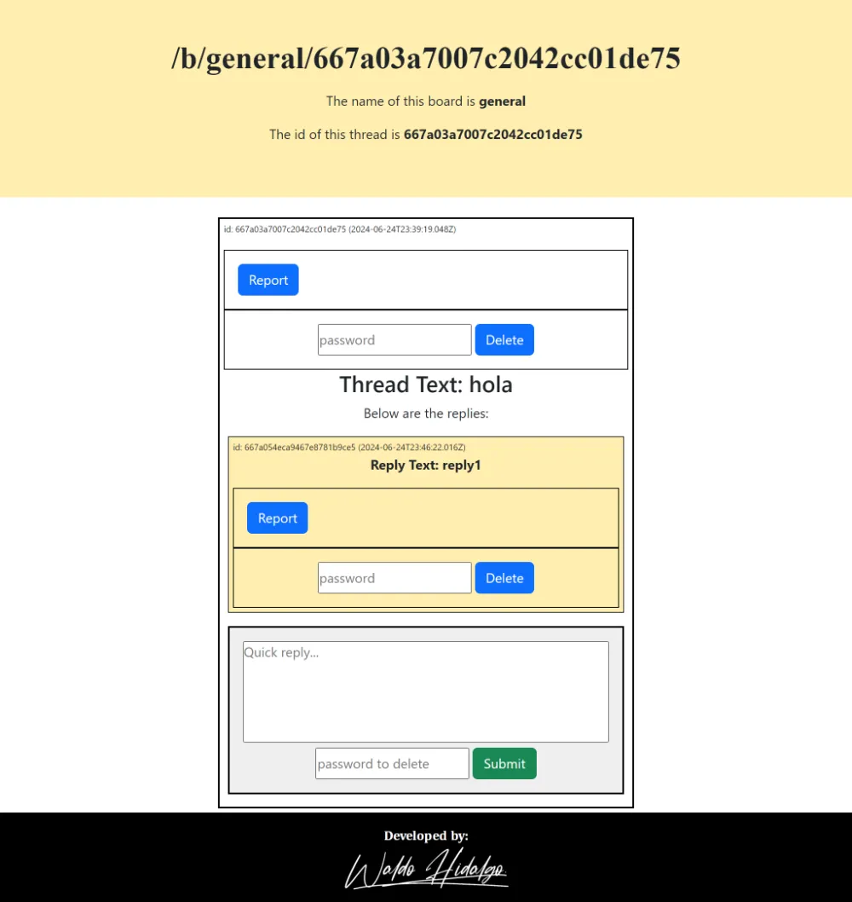

### 6.Board with many threads and replies

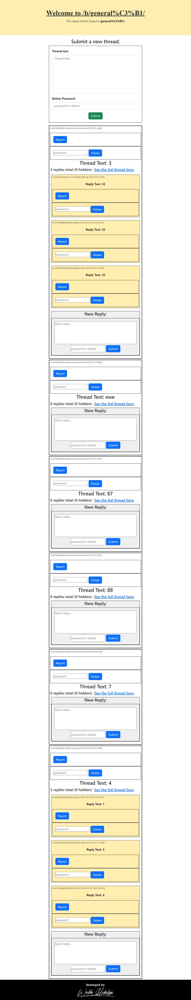

### 7.GET to /api/threads/board

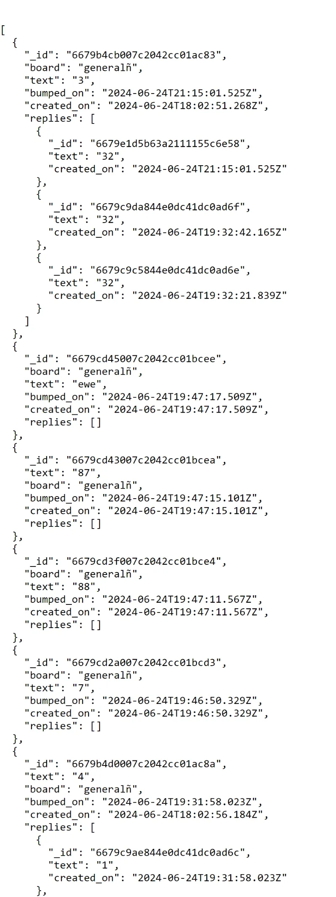

### 8. GET to /api/replies/{board}?thread_id={thread_id}

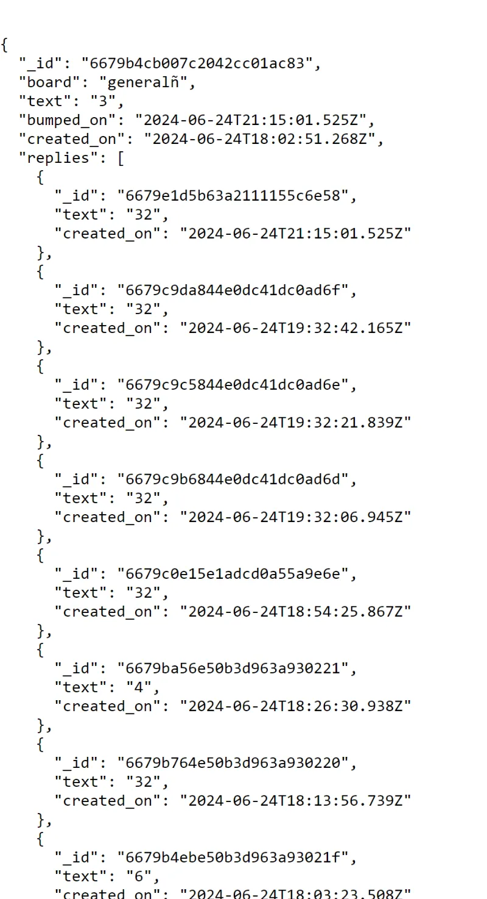
